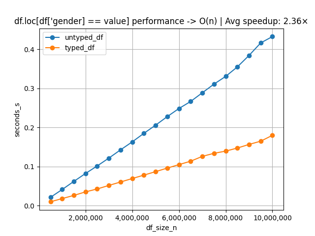
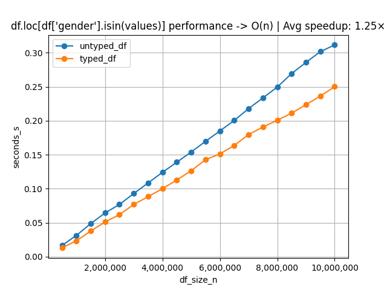
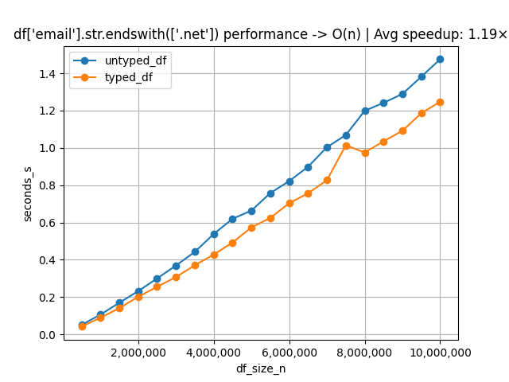

Let's go over the ins and outs of how to increase pandas dataframe performance.
If you've ever dealt with large datasets in python, you have probably encountered performance issues. There are alternative solutions already built out to help with this (most popularly polars and duckdb), but pandas has a lot of perks, mainly the ease of use. The ease of use comes with a cost -- speed.

So let's figure out how we can get the best of both worlds - the ease of use of pandas and the speed of polars and duckdb.

Let's walk through a real world example. I created a dataset of 10million humans using the python library `Faker`. Each row has 6 columns: 

- name
- address
- email
- date of birth
- bioligical kids

Here is the pertinent code snippet from my faker generation script:

```python
from faker import Faker


def make_row(fake: Faker) -> dict:
    address = fake.address().replace("\n", ", ")
    dob = fake.date_of_birth(minimum_age=18, maximum_age=65).isoformat()
    return {
        "name": fake.name(),
        "address": address,
        "email": fake.email(),
        "date_of_birth": dob,
        "biological_kids": fake.pyint(min_value=0, max_value=69),  # 69 kids is the current guinness world record for most kids by one individual
        "gender": fake.random_element(elements=("male", "female")),
    }
```

In my script, I called this function `make_row` 10 million times. And wahlah, I now have a 1GB file primed for testing.

Before diving into the optimization of pandas, lets discuss one of the key metrics used to determine if the code needs optimization - memory usage. In pandas, you can view the current memory of your dataframe by calling `df.info()`. In my dataset, my dataframe of 10 million rows takes up `457.8 MB`. Pandas is already doing some optimizing behind the scenes. We went from a 1GB file to almost half of that simply by letting Pandas do its magic. I'm on a Macbook pro that has 16gb of RAM, so `457 MB` isn't too problematic, but almost half a gig for one python variable is pretty staggering. Let's say that this code will later be deployed to an api on AWS; I would like to save money. Being able to use a server with less RAM is usually the cheaper option.

We are going to operate under the assumption that `decreasing dataframe memory has a direct increase on speed`. This is almost always true, but not guarunteed. Nonetheless, it is a great white glove test or temperature gauge for your code's performance. Using this maxim, let's begin optimizing.

The first change that will almost always have the biggest impact on memory/speed is typing your dataframe. You can set dataframes types with code similar to this:

```python
dtypes = {
    "name": "string",
    "address": "string",
    "email": "string",
    "date_of_birth": "datetime64[ns]",
    "biological_kids": "int8",
    "gender": "category",
}
df_w_dtypes = df.astype(dtypes)
```

In fact, this is how we typed all the data inside our 10 million row dataset. 
The untyped dataframe of our dataset uses `457.8 MB` and the typed dataframe uses `324.2 MB`. All we did was add basic typing and we already save `133 MB` of data?? That's a big win if you ask me. 

With this change in our dataset, let's run some tests.
I created a function that generates plots between functions on the typed df and untyped df.

Using the function `df.loc[df["gender"] == "female"]` we can see that we have an averages increase in speed of 2.36x!


Let's explore other functions with this change:

`df.loc[df["gender"].isin("female")]`


`df.loc[df["email"].str.endswith(".net")]`


Something to take special note of in pandas is your read-in time. I was average about 3.5 seconds for reading in my 1gb file. Other libraries destroy this number in comprarison, mainly dask and polars.

Here are my results of reading in the parquet file:
```text
dask.read_parquet   - 0.002297379200172145 seconds # Over 1400x faster than pandas!
polars.read_parquet - 0.15947427499922923 seconds  # 21 x faster than pandas
pandas.read_parquet - 3.361971120799717 seconds
```

These are huge increases. Depending on your script, which may only filter a handful of times, these libraries will have read your file in and filtered the data while pandas is still creating the df from your parquet. 

While I am extremely pro pandas, you have to be practical. It's important to note these differences and what options are available when creating scripts that work with large datasets. You might be thinking to yourself that with dask or polars, why not read the parquet in and then convert it to a pandas dataframe? Wouldn't that be much quicker? Well, not really, I did find that dask gave a slight increase in speed when reading in and converting to pandas, but the pandas conversion step is extremely heavy and uses all the remaining time that would actually make it faster.